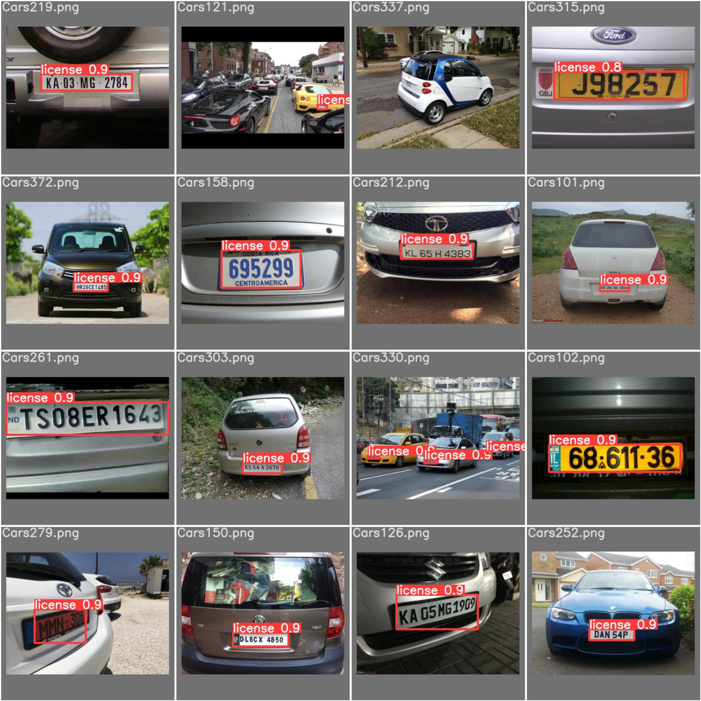

# Automatic License Plate Recognition

## Objective
This project consists of developing an automatic license plate recognition system. It is able to detect car license plates from images and extract their content in the form of text strings.

For this, we have used the already trained Yolov5 network and we have retrained 300 epochs in detecting license plates using around 500 car images. 
Once the license plate was detected, OCR was used on the image of the license plate itself.

Here are some validation samples.

And here the predictions made by our model

